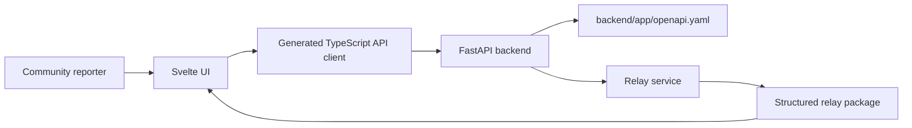

# SautiRelay Architecture

## Current Architecture

SautiRelay is a local-first Svelte 5 + FastAPI application. The frontend and backend communicate only through the OpenAPI contract at `backend/app/openapi.yaml`.

## Local Services

- Frontend: Svelte 5 with Vite on port `5173`.
- Backend: FastAPI on port `8000`.
- Contract: `backend/app/openapi.yaml`.
- Local orchestration: `docker/docker-compose.yml`.

## Backend Boundary

The backend owns validation, relay structuring, privacy-preserving normalization, and route recommendation. The MVP should keep this deterministic and testable before introducing persistence or provider-backed AI.

## Frontend Boundary

The frontend owns report capture, consent presentation, validation display, and result rendering. It should use Svelte 5 runes, CSS Modules, and extracted TypeScript logic files. It should not duplicate backend business rules except for basic form affordances.

## Engineering Rule Alignment

Engineering standards live in `docs/engineering/`. The repo-level `AGENTS.md` is the portable entrypoint for agents and contributors. Cursor-specific files under `.cursor/rules/` are adapters that route to the canonical engineering docs.

Because this repo currently uses Svelte with Vite and a separate FastAPI backend, SvelteKit-only patterns apply only if the project later adopts SvelteKit.

## Request Flow

1. Reporter submits a relay form in the Svelte UI.
2. UI sends the payload through the generated TypeScript client.
3. FastAPI validates the request against schemas aligned with the OpenAPI contract.
4. Relay service produces a structured response.
5. UI displays the result and next-step state.

## Location Handling

Location should be optional and purpose-bound. The MVP supports:

- No location.
- Manual location text such as area, ward, county, district, or nearby landmark.
- Approximate browser location only after explicit consent, rounded or generalized before relay.

Precise coordinates should not be stored or displayed by default.

## Future AWS Shape

Future deployment may use:

- S3 + CloudFront for frontend hosting.
- Lambda + API Gateway for backend.
- Managed database or object storage for relay records.
- Queue or notification service for responder handoff.

No AWS deployment code should be added until explicitly requested.
